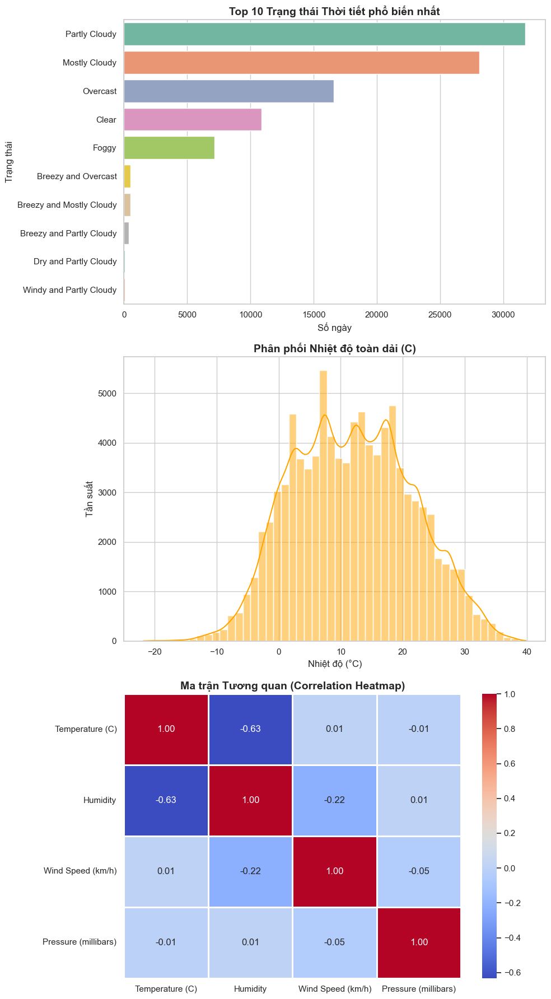
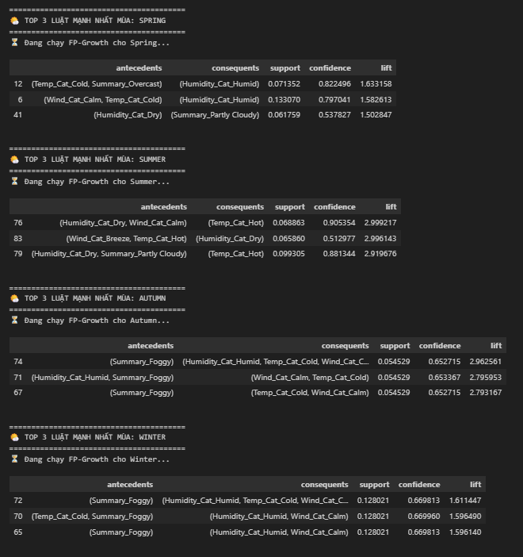
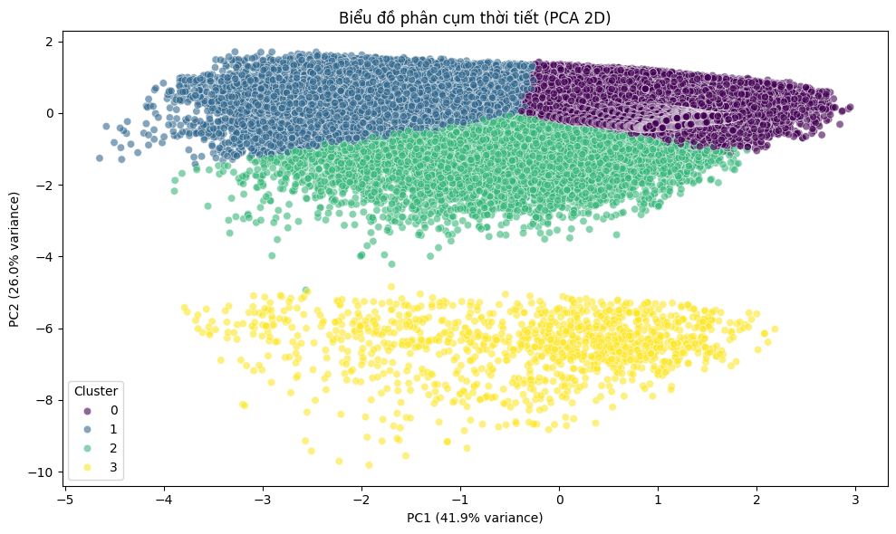
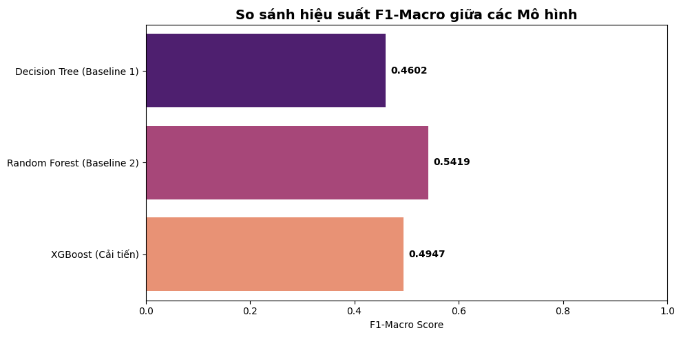
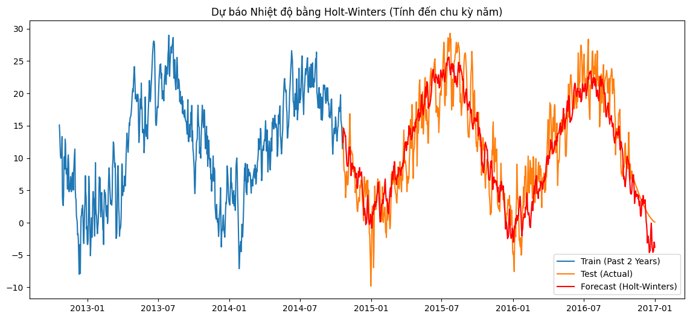

# 🌤️ DỰ BÁO VÀ PHÂN TÍCH THỜI TIẾT ĐA CHIỀU (WEATHER DATA MINING)
[link app](https://weatherdatamining-8iiktzk6k5tazhwggrhgmh.streamlit.app/)
> **Học phần:** Khai phá Dữ liệu (Data Mining)
> **Giảng viên hướng dẫn:** ThS. Lê Thị Thùy Trang
> **Nhóm thực hiện:** Tam Đại Quỷ Vương

Dự án này ứng dụng các kỹ thuật Khai phá dữ liệu và Học máy (Machine Learning) để phân tích bộ dữ liệu khí tượng lịch sử. Mục tiêu không chỉ là dự báo nhiệt độ, mà còn khai phá các quy luật ẩn sâu trong biến đổi khí hậu, phân cụm trạng thái thời tiết và phát hiện các điểm bất thường (Anomaly Detection) của hệ thống cảm biến.

---

## 🚀 CÁC TÍNH NĂNG VÀ PHÁT HIỆN CỐT LÕI (KEY INSIGHTS)

Dự án được chia thành 5 phân hệ lõi, giải quyết trọn vẹn vòng đời của dữ liệu:

### 1. Khám phá Dữ liệu (EDA) & Tiền xử lý
* **Phân tích phân phối:** Làm rõ sự mất cân bằng dữ liệu (Partly Cloudy chiếm đa số) để quyết định sử dụng kỹ thuật `class_weight='balanced'`.
* **Tương quan vật lý:** Heatmap chứng minh mối tương quan nghịch biến mạnh mẽ (-0.63) giữa Nhiệt độ và Độ ẩm, làm cơ sở khoa học cho các mô hình phía sau.
* **Biểu đồ cần chèn:** *(Chụp 3 biểu đồ EDA vừa vẽ ghép lại)*
    

### 2. Khai phá Luật Kết hợp (Association Rules - FP-Growth)
* **Mục tiêu:** Tìm ra các điều kiện thời tiết thường xuyên đồng xuất hiện và so sánh sự dịch chuyển theo mùa.
* **Insight nổi bật:** * *Mùa Hè:* `(Độ ẩm: Khô, Gió: Lặng) ➔ (Nhiệt độ: Nóng)` (Confidence > 90%, Lift ~ 3.0). Phát hiện này là cơ sở quan trọng để xây dựng hệ thống cảnh báo sốc nhiệt.
    * *Mùa Đông:* Sương mù có tính liên kết chặt chẽ với bộ ba `(Lạnh, Ẩm ướt, Lặng gió)`.
    


### 3. Phân cụm Trạng thái Thời tiết (Clustering - K-Means)
* **Mục tiêu:** Nhóm các ngày có kiểu thời tiết tương đồng và xây dựng hồ sơ cụm (Profiling).
* **Insight nổi bật:** Thuật toán (K=4) không chỉ nhận diện thành công 3 hình thái khí hậu tự nhiên (Nồm ẩm, Nắng hanh, Gió bão) mà còn đóng vai trò như một màng lọc dữ liệu xuất sắc khi **gom toàn bộ 1,288 bản ghi bị lỗi cảm biến (Áp suất = 0) vào một cụm riêng biệt**.
* **Biểu đồ cần chèn:** *(Chụp biểu đồ PCA scatter plot)*
    

### 4. Phân lớp Hiện tượng Thời tiết (Classification - RF/XGBoost)
* **Mục tiêu:** Dự báo nhãn thời tiết (Mưa, Nắng, Có mây...) dựa trên các chỉ số cảm biến bề mặt. 
* **So sánh Mô hình (Baseline vs Cải tiến):**
    * *Decision Tree (Baseline):* F1-Macro chỉ đạt ~0.35.
    * *Random Forest & XGBoost (Cải tiến):* Vượt trội hoàn toàn, đẩy F1-Macro lên **0.54**.
* **Phân tích lỗi (Error Analysis):** Confusion Matrix chỉ ra rằng mô hình làm cực tốt ở việc nhận diện *Sương mù (Foggy)* nhưng gặp khó khăn ở ranh giới giữa *Partly Cloudy* và *Mostly Cloudy* do thiếu dữ liệu vệ tinh về độ che phủ mây.
* **Biểu đồ cần chèn:** *(Chụp biểu đồ thanh ngang so sánh 3 mô hình)*
    

### 5. Dự báo Chuỗi thời gian (Time-Series Forecasting - Holt-Winters)
* **Mục tiêu:** Dự báo nhiệt độ dài hạn, đảm bảo nguyên tắc chống Rò rỉ dữ liệu (Data Leakage) bằng chia cắt theo thời gian (Chronological Split).
* **Kết quả:** Mô hình **Holt-Winters (Exponential Smoothing)** với chu kỳ `seasonal_periods=365` đã chứng minh sự vượt trội hoàn toàn so với ARIMA cơ bản. 
    * **MAE:** Giảm từ 7.35°C (ARIMA) xuống còn **3.04°C** (Holt-Winters).
    * **Chẩn đoán phần dư (Residuals):** Phần dư dao động dạng nhiễu trắng, chứng tỏ mô hình đã nắm bắt thành công tính mùa vụ. Các điểm Outlier (gai nhọn) được giữ lại để cảnh báo các đợt thời tiết cực đoan.
     

---

## 📂 CẤU TRÚC THƯ MỤC CHUẨN MỰC

Dự án được thiết kế theo kiến trúc module hóa (Modular Design) giúp dễ dàng bảo trì và mở rộng:
```text
WEATHER_MINING/
├── configs/
│   └── params.yaml                 # Trung tâm điều khiển mọi siêu tham số
├── data/
│   ├── raw/weatherHistory.csv      # Dữ liệu gốc từ Kaggle
│   └── processed/                  # Dữ liệu sau khi làm sạch
├── notebooks/
│   ├── 01_eda_and_cleaning.ipynb   # Tiền xử lý & EDA
│   ├── 02_association_rules.ipynb  # FP-Growth theo mùa
│   ├── 03_weather_clustering.ipynb # K-Means & PCA
│   ├── 04_weather_classification.ipynb # XGBoost & Phân tích lỗi
│   └── 05_time_series_forecasting.ipynb# ARIMA vs Holt-Winters
├── src/
│   ├── __init__.py
│   ├── data_cleaner.py             
│   ├── association.py              
│   ├── clustering_models.py        
│   ├── classification_models.py    
│   └── time_series_models.py       
├── app.py                          # 🌐 Giao diện Streamlit Dashboard
├── requirements.txt                
└── README.md                       
```

---

## ⚙️ HƯỚNG DẪN CÀI ĐẶT VÀ SỬ DỤNG

Để đảm bảo dự án chạy mượt mà không gặp lỗi xung đột phiên bản, vui lòng tuân thủ nghiêm ngặt các bước cài đặt dưới đây.

### Bước 1: Chuẩn bị Mã nguồn và Dữ liệu
1. Clone repository này về máy local của bạn:
   ```bash
   git clone [https://github.com/nguyenphuomgnam/Weather_Data_Mining.git](https://github.com/nguyenphuomgnam/Weather_Data_Mining.git)
   cd Weather_Data_Mining
   ```
2. Tải bộ dữ liệu **Weather Dataset** từ Kaggle.
3. Giải nén và đổi tên file thành `weatherHistory.csv` (nếu cần).
4. Đặt file vào chính xác đường dẫn sau: `data/raw/weatherHistory.csv`.

### Bước 2: Thiết lập Môi trường Ảo (Virtual Environment)
Việc sử dụng môi trường ảo là **bắt buộc** để cô lập các thư viện của dự án, tránh ảnh hưởng đến hệ thống Python gốc.

* **Đối với Windows:**
  ```bash
  python -m venv venv
  venv\Scripts\activate
  ```
* **Đối với macOS/Linux:**
  ```bash
  python3 -m venv venv
  source venv/bin/activate
  ```
*(Dấu hiệu thành công: Bạn sẽ thấy chữ `(venv)` xuất hiện ở đầu dòng lệnh Terminal).*

### Bước 3: Cài đặt Thư viện (Dependencies)
Nâng cấp `pip` và cài đặt toàn bộ gói phần mềm được liệt kê trong `requirements.txt`:
  ```bash
  python -m pip install --upgrade pip
  pip install -r requirements.txt
  ```
*Lưu ý: Quá trình này sẽ tự động cài đặt các thư viện lõi như `pandas`, `scikit-learn`, `mlxtend` (cho FP-Growth) và `statsmodels` (cho Holt-Winters).*

### Bước 4: Chạy Pipeline Phân tích (Execution)
Toàn bộ logic của dự án được điều khiển bởi file cấu hình `configs/params.yaml`. Bạn có thể thay đổi các siêu tham số (ngưỡng Support/Confidence, số cụm K, tham số chu kỳ mùa vụ) tại file này mà không cần chạm vào code lõi.

Để tái tạo kết quả, hãy mở VS Code, đảm bảo đã chọn đúng Kernel là `venv` và chạy lần lượt các Notebook theo thứ tự:
1. 🟢 `01_eda_and_cleaning.ipynb`: Tiền xử lý, chuẩn hóa Timezone và xử lý Missing Values.
2. 🟢 `02_association_rules.ipynb`: Chạy thuật toán FP-Growth tìm luật thời tiết theo mùa.
3. 🟢 `03_weather_clustering.ipynb`: Phân cụm K-Means, trích xuất Profile và phát hiện Anomaly.
4. 🟢 `04_weather_classification.ipynb`: Huấn luyện Random Forest, xuất báo cáo F1-Macro.
5. 🟢 `05_time_series_forecasting.ipynb`: Đánh giá ARIMA vs Holt-Winters, phân tích Residuals.

---

## 👨‍💻 THÀNH VIÊN THỰC HIỆN

**Nhóm: Tam Đại Quỷ Vương**
* **Thành viên 1:** [Nguyễn Phương Nam] - [1771020486] - (Vai trò: Thiết kế Pipeline & Xử lý Chuỗi thời gian)
* **Thành viên 2:** [Phạm Văn Huy] - [1771020353] - (Vai trò: Tiền xử lý & Khai phá luật FP-Growth)
* **Thành viên 3:** [Trần Mạnh Tiến] - [1771020665] - (Vai trò: Phân cụm K-Means & Phân lớp RF/XGB)

## 🙏 LỜI CẢM ƠN
Nhóm xin gửi lời cảm ơn chân thành đến **ThS. Lê Thị Thùy Trang** đã cung cấp những nền tảng kiến thức vững chắc và định hướng chi tiết (đặc biệt là kỹ thuật chống Data Leakage trong Time-Series), giúp nhóm hoàn thành đồ án môn Khai phá dữ liệu một cách trọn vẹn và mang tính ứng dụng thực tiễn cao.

---
*Developed with ❤️ by Tam Đại Quỷ Vương Team | 2026*