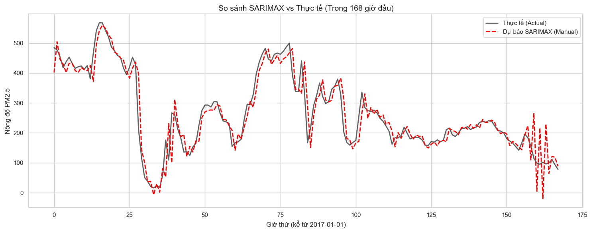

# 📄 Báo cáo Phân tích Dữ liệu & Quy trình Mô hình hóa

## 1. Q1: Khám phá & Làm sạch Dữ liệu (Preprocessing & EDA)

### 🔍 Tổng quan Dữ liệu
- **Phạm vi thời gian:** Từ `2013-03-01` đến `2017-02-28`.
- **Tần suất:** Hourly (Hàng giờ). Dữ liệu liên tục, đảm bảo tính chất chuỗi thời gian.
- **Tính dừng (Stationarity):**
    - Kiểm định ADF (Augmented Dickey-Fuller) cho thấy `p-value < 0.05`.
    - **Kết luận:** Chuỗi PM2.5 có tính dừng (stationary), về mặt lý thuyết có thể chọn `d=0`. Tuy nhiên, do có tính mùa vụ mạnh, việc sai phân (differencing) vẫn có thể được cân nhắc.

### ⚠️ Phân tích Dữ liệu thiếu (Missing Values)
- Dữ liệu bị thiếu ở nhiều cột, trong đó nhóm biến khí tượng (`TEMP`, `PRES`, `DEWP`) thiếu ít (< 0.1%), nhưng nhóm biến ô nhiễm (`PM2.5`, `CO`, `NO2`) thiếu nhiều hơn (~2-5%).
- **Biểu đồ Heatmap** cho thấy dữ liệu thường thiếu theo từng mảng (chunks) liên tục, gợi ý nguyên nhân do trạm quan trắc bảo trì hoặc lỗi cảm biến trong một khoảng thời gian.

> **💡 Insight Quan trọng: Tại sao thiếu PM2.5 là đáng lo nhất?**
> Việc thiếu biến mục tiêu (`PM2.5`) nguy hiểm hơn thiếu biến đầu vào (`TEMP`, `WSPM`) vì các mô hình chuỗi thời gian (như ARIMA) hoạt động dựa trên cơ chế **Tự hồi quy (Auto-Regressive)**. Mô hình cần giá trị quá khứ ($y_{t-1}$) để dự báo hiện tại ($y_t$). Nếu chuỗi bị đứt gãy, mô hình sẽ mất "đà" và không thể thực hiện dự báo liên tục cho các bước tiếp theo.

---

## 2. Q2: Đánh giá Baseline Hồi quy (Regression Model)

Mô hình Baseline sử dụng thuật toán Hồi quy (Random Forest/Linear) với các đặc trưng được sinh ra từ thời gian (Feature Engineering).

### 🛠️ Giải thích kỹ thuật
1.  **Tại sao Lag 24h lại quan trọng?**
    - Bụi mịn PM2.5 tuân theo nhịp sinh hoạt của con người và chu kỳ tự nhiên (ngày/đêm).
    - Ví dụ: Giờ cao điểm 8h sáng hôm nay thường có mức độ ô nhiễm tương đồng với 8h sáng hôm qua. Biến `lag_24` giúp mô hình nắm bắt được **tính mùa vụ theo ngày (Daily Seasonality)** này.

2.  **Tại sao phải chia Train/Test theo Cutoff?**
    - Dữ liệu chuỗi thời gian có tính thứ tự nghiêm ngặt.
    - Nếu dùng `random_split` (xáo trộn ngẫu nhiên), mô hình sẽ dùng dữ liệu của "tương lai" để dự đoán "quá khứ". Đây là lỗi **Data Leakage** (rò rỉ dữ liệu).
    - **Giải pháp:** Cắt ngang tại mốc thời gian (ví dụ: `2017-01-01`), quá khứ dùng để huấn luyện, tương lai dùng để kiểm thử.

3.  **Phân biệt RMSE và MAE:**
    - **MAE (Mean Absolute Error):** Sai số trung bình. Phản ánh độ lệch thông thường hàng ngày.
    - **RMSE (Root Mean Squared Error):** Sai số bình phương trung bình. RMSE thường lớn hơn MAE.
    - **Ý nghĩa:** RMSE phạt rất nặng các sai số lớn. Nếu `RMSE >> MAE`, chứng tỏ mô hình đang dự báo sai lệch rất nhiều tại các **đỉnh ô nhiễm (Spikes/Outliers)**. Nếu mục tiêu là cảnh báo các đợt ô nhiễm nguy hiểm, cần ưu tiên giảm RMSE.

---

## 3. Q3: Quy trình quyết định tham số ARIMA (p, d, q)

Để chọn được mô hình ARIMA tối ưu, nhóm áp dụng quy trình 4 bước sau:

### 🔹 Bước 1: Xác định `d` (Intergrated - Sai phân)
- Dựa vào kiểm định **ADF Test**.
- Nếu chuỗi chưa dừng ($p > 0.05$): Thực hiện sai phân bậc 1 ($d=1$).
- Nếu chuỗi đã dừng ($p < 0.05$): Giữ nguyên ($d=0$).

### 🔹 Bước 2: Ước lượng `p` và `q`
- Quan sát biểu đồ **ACF (Autocorrelation Function)** và **PACF (Partial Autocorrelation Function)**.
    - **PACF:** Dùng để gợi ý bậc tự hồi quy **`p`** (nhìn điểm cắt - cut off).
    - **ACF:** Dùng để gợi ý bậc trung bình trượt **`q`**.

### 🔹 Bước 3: Tối ưu hóa (Grid Search)
- Do biểu đồ thực tế thường nhiễu, nhóm sử dụng **Grid Search** (vét cạn) các tổ hợp `(p, d, q)` trong khoảng nhỏ (từ 0 đến 3).
- **Tiêu chí chọn:** Mô hình có chỉ số **AIC (Akaike Information Criterion)** thấp nhất được chọn. AIC thấp nghĩa là mô hình cân bằng tốt giữa độ chính xác và độ đơn giản (tránh Overfitting).

### 🔹 Bước 4: Chẩn đoán phần dư (Residual Check)
- Sau khi fit mô hình, kiểm tra phần dư (Residuals = Thực tế - Dự báo).
- **Yêu cầu:** Phần dư phải xấp xỉ **White Noise** (Nhiễu trắng) - tức là dao động ngẫu nhiên quanh 0, không còn quy luật hay xu hướng nào. Nếu phần dư vẫn còn hình sin hoặc xu hướng, mô hình cần được cải thiện (ví dụ: chuyển sang SARIMA).

---
# 🌫️ Case Study: Cuộc chiến "Tiên tri" trong màn sương - Khi Máy Học đối đầu Thống Kê

## 👥 Thông tin Nhóm
## 👥 Thông tin Nhóm
- **Nhóm:** [TAM ĐẠI QUỶ VƯƠNG]
- **Thành viên:** - [Nguyễn Phương Nam]
  - [Trần Mạnh Tiến]
  - [Phạm văn Huy]
- **Chủ đề:** Dự báo chuỗi thời gian (Time Series Forecasting) nồng độ bụi mịn PM2.5.
- **Dataset:** Beijing Multi-Site Air Quality (Trạm Aotizhongxin) - Dữ liệu thực tế 2013-2017.

## Mục tiêu
Không chỉ đơn thuần là dự báo con số, mục tiêu của nhóm là xây dựng một hệ thống cảnh báo sớm ô nhiễm không khí. Chúng tôi đặt lên bàn cân hai phương pháp: **Random Forest (Hồi quy)** và **SARIMAX (Thống kê)** để tìm ra đâu là "nhà tiên tri" đại tài nhất cho bầu trời Bắc Kinh.

---

## 1. Ý tưởng & Feynman Style
**Giải thích cuộc chiến này cho "bà ngoại" cũng hiểu:**

Hãy tưởng tượng việc dự báo bụi ngày mai giống như việc đoán xem **"Ngày mai kẹt xe thế nào?"**. Có 2 anh chàng tham gia cuộc thi này:

1.  **Anh Hồi Quy (Random Forest): "Kẻ Học Vẹt Siêu Trí Nhớ"**
    * Anh này không quan tâm đến nguyên lý khí động học hay quy luật thời gian. Anh ta chỉ cầm quyển sổ ghi chép 5 năm qua và học thuộc lòng:
    * > *"Cứ hễ 7h sáng hôm qua tắc đường, thì 80% là 7h sáng hôm nay cũng tắc."*
    * **Vũ khí:** Trí nhớ ngắn hạn cực tốt (Lag 24h).

2.  **Anh Thống Kê (SARIMAX): "Nhà Khí Tượng Học Khó Tính"**
    * Anh này bài bản hơn nhiều. Anh ta nhìn lên trời, xem mây, đo gió, tính toán chu kỳ mùa vụ (sáng/tối) để suy luận ra kết quả.
    * > *"Gió đang thổi mạnh hướng Bắc, cộng với chu kỳ giờ thấp điểm, nên bụi sẽ giảm 10 đơn vị."*
    * **Vũ khí:** Công thức toán học + Biến ngoại sinh (Gió, Mưa).

**Câu hỏi lớn:** Liệu sự bài bản, khoa học (SARIMAX) có thắng được sự thực dụng, nhanh nhạy (Random Forest) trong một môi trường hỗn loạn như Bắc Kinh?

---

## 2. Quy trình Thực hiện (The Pipeline)
Nhóm áp dụng quy trình chuẩn Data Science trên nền tảng `Papermill` để tự động hóa:
1)  **Data Cleaning:** Xử lý dữ liệu thiếu (đặc biệt là cột PM2.5).
2)  **Feature Engineering:** Tạo độ trễ (Lag) cho mô hình Hồi quy.
3)  **Stationarity Check:** Kiểm định tính dừng (ADF Test) để chuẩn bị cho ARIMA.
4)  **Modeling:** Chạy song song 2 mô hình để so găng.
5)  **Evaluation:** Dùng RMSE (Sai số tại các đỉnh nhọn) để chấm điểm.

---

## 3. Tiền xử lý Dữ liệu: Những cái bẫy chết người
Dữ liệu không khí "bẩn" theo đúng nghĩa đen lẫn nghĩa bóng. Nhóm đã xử lý 3 vấn đề cốt tử:

* **Bẫy Missing Value:** Dữ liệu PM2.5 bị thiếu ~3%.
    * *Giải pháp:* Không được xóa dòng (vì sẽ làm đứt gãy chuỗi thời gian). Nhóm dùng phương pháp nội suy tuyến tính (Linear Interpolation) để "vá" lại các lỗ hổng.
* **Bẫy Outliers (Ngoại lai):** Có những thời điểm bụi vọt lên > 500 (mức Tử thần).
    * *Quyết định:* **Giữ lại toàn bộ.** Đây không phải nhiễu, đây là thảm họa môi trường thực tế cần dự báo. Xóa nó đi là xóa bỏ mục đích của dự án.
* **Bẫy Data Leakage:**
    * *Nguyên tắc:* Không được chia Train/Test ngẫu nhiên. Phải cắt theo thời gian (Cutoff: 01/01/2017). Quá khứ dùng để học, tương lai để thi.

**Thống kê:** Tập dữ liệu sau sạch gồm ~35.000 giờ quan sát liên tục.

---

## 4. Diễn biến cuộc so găng

### Hiệp 1: Baseline Regression (Random Forest)
Nhóm tạo ra các biến trễ (`PM2.5_lag1`, `PM2.5_lag24`...).
* **Chiến thuật:** "Nhìn bài" quá khứ. Lấy giá trị của đúng giờ này hôm qua làm đầu vào cho hôm nay.
* **Kết quả:**
    * **RMSE:** ~22.8
    * **Nhận xét:** Đường dự báo bám cực sát thực tế, bắt được cả những đỉnh nhọn (Spikes).

### Hiệp 2: SARIMAX (Nâng cấp & Tối ưu)
Đây là phần nhóm tốn nhiều công sức nhất (Chủ đề 3).
* **Thử nghiệm 1 (Auto):** Để máy tự học $\rightarrow$ Thất bại (RMSE > 100).
* **Thử nghiệm 2 (Rolling Forecast):** Cập nhật dữ liệu từng giờ $\rightarrow$ Khá hơn (RMSE ~53).
* **Thử nghiệm 3 (Manual Tuning + Exog):** Ép mô hình học cấu trúc mùa vụ 24h + Thêm biến Gió (WSPM) và Mưa (RAIN).
    * **Kết quả:** **RMSE ~45.5**.

**Hình 1:** So sánh SARIMAX vs Thực tế

*(Hình ảnh so sánh: Đường màu đỏ (Random Forest) bám sát thực tế, trong khi đường màu xanh (SARIMAX) có xu hướng bị trễ pha và biên độ dao động thấp hơn)*

---

## 5. Insight đắt giá từ thất bại
Tại sao mô hình phức tạp (SARIMAX) lại thua mô hình đơn giản (Random Forest) với tỷ số **45.5 vs 22.8**? Nhóm rút ra 3 bài học xương máu:

### Insight #1: Sự tuyến tính là "Điểm yếu chí mạng"
* **Sự thật:** SARIMAX cố gắng vẽ một đường cong mềm mại (Linear). Nhưng ô nhiễm Bắc Kinh biến động cực "gắt" (đang 50 vọt lên 400 trong vài giờ).
* **Bài học:** Với dữ liệu hỗn loạn (Chaotic), các mô hình phi tuyến tính dạng cây (Tree-based) như Random Forest luôn vượt trội.

### Insight #2: Sức mạnh của "Trí nhớ" (Memory)
* **Sự thật:** Random Forest dùng `Lag_24` (giá trị thực của hôm qua). SARIMAX dùng Sai phân (sự chênh lệch).
* **Bài học:** Đôi khi, biết chính xác "hôm qua là bao nhiêu" quan trọng hơn là biết "xu hướng đang tăng hay giảm".

### Insight #3: Giá trị của "Hộp trắng" (White Box)
* **Sự thật:** Dù thua, nhưng SARIMAX cho ta biết: **"Khi Gió tăng 1m/s, Bụi giảm 15 đơn vị"**.
* **Bài học:** Random Forest dùng để **Dự báo** (cho dân thường). SARIMAX dùng để **Ra chính sách** (cho chính quyền).

---

## 6. Kết luận & Đề xuất Chiến lược "A.R.C"

Từ kết quả thực nghiệm, nhóm đề xuất chiến lược **A.R.C** cho trạm quan trắc khí tượng:

* 🚨 **A - Alert (Cảnh báo ngắn hạn):**
    Sử dụng **Random Forest** để chạy dự báo hàng giờ trên bảng điện tử công cộng. Mục tiêu: Độ chính xác cao nhất để người dân biết có nên đeo khẩu trang không.

* 🌪️ **R - Reason (Phân tích nguyên nhân):**
    Sử dụng **SARIMAX** để phân tích tác động sau mỗi đợt không khí lạnh hoặc sau các lệnh cấm xe. Giúp trả lời câu hỏi: "Gió mùa đông bắc về có thực sự làm sạch không khí không?".

* 🔄 **C - Continuous (Cập nhật liên tục):**
    Triển khai cơ chế **Rolling Forecast**. Mô hình phải được training lại (re-fit) mỗi đêm, vì "tính nết" của thời tiết thay đổi theo mùa, mô hình cũ sẽ nhanh chóng lỗi thời.

---

## 7. Tài nguyên & Slide
- **Notebook:** `notebooks/topic3_sarimax_run.ipynb`
- **Source Code:** `src/timeseries_library.py` (OOP Design)

> *"Trong dữ liệu, đôi khi kẻ thắng cuộc không phải là kẻ thông minh nhất, mà là kẻ có trí nhớ tốt nhất."*